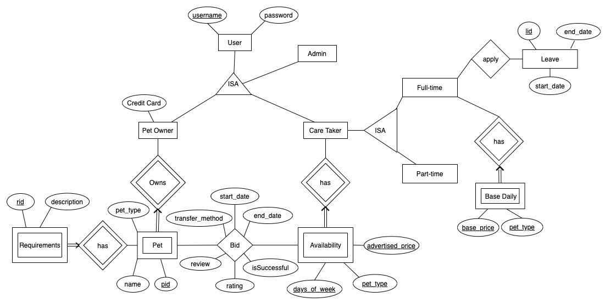

# CS2102_AY2021_S1_Group 40 Pet Caring

CS2102 Database Systems: Introduction to Web Application Development

This is a project done by a group of students from the National University of Singapore for the module
CS2102: Database Systems.

The following contains mainly setup instructions. Refer to our [Project Report](Project%20Report.pdf) for more details.

Project Demo Video: https://www.youtube.com/watch?v=BZTjCrFfHSA&feature=youtu.be

Team Members:

- Caijie
- Michelle
- Phoebe
- Sheryl
- Wei Kiat

Tech Stack:

- Frontend: React, Material-UI
- Backend: Node.js, Express
- Database: PostgreSQL

## Heroku

We use Heroku to host both our Frontend and Backend.

Frontend: https://cs2102petlovers.herokuapp.com

Backend: https://cs2102petloversapi.herokuapp.com

To access the hosted database:

1. Install heroku-cli
2. `heroku login`. Contact us for access rights!
3. If you want to run a single sql command: `echo "<sqlcommand>" | heroku pg:psql`
4. If you want to run a batch file: `cat <filepath> | heroku pg:psql`

## Continuous Integration/Deployment 

We use Travis to continuously integrate, test and deploy our Javascript changes.

## Setup Locally

1. Make sure you have node and npm installed. The quickest way is to use homebrew and do `brew install node`.
2. `npm install` to install all dependencies
3. Create a local instance of postgreSQL database.
   1. Make sure you have postgres installed. `brew install postgresql`.
   2. Start postgres server. `brew services start postgresql` or `brew services restart postgresql`
   3. Create a database. `createdb <dbname>` (Drop database by `dropdb <dbname>`)
   4. Load the build schema. `psql -d <dbname> < build-schema.sql`
   5. Load the dataset. `psql -d <dbname> < add-data.sql`
4. Create a `.env` file in the project root and specify the `DATABASE_URL` like this: `DATABASE_URL="postgresql://<dbuser>:<dbpassword>@localhost:5432/<dbname>"`.
5. `npm start`. This should run the api on port 8080 by default.

Tips:

1. You can do `psql -d <dbname>` to enter into your database cmd and execute SQL queries directly there.
2. In your database cmd after you do step 1, you can do `\l` to see all your databases and `\d` to see all your tables.

## Lint checking with Prettier

Do `npm run prettier` in project root to auto format all your code nicely!

## Setup frontend locally

1. `cd public` from project root. This is the folder containing the React app.
2. If you are running the API locally, you need to change the `API_HOST` in `consts.js` to your locally running API instance URL.
3. Refer to the [README](public/README.md) inside `public` for further instructions.

Note: We use different package managers: npm for back-end and yarn for front-end.
Don't do `npm install` for front-end! Similarly, don't do `yarn` for back-end!

## ER Diagram

## Preliminary Constraints

### Constraints shown in ER Diagram

1. Each User is a Pet Owner, Care Taker or a PCS Administrator. This constraint is covering and overlapping as a pet owner can also be a care taker.
2. Each User can be identified by their username and has a password attribute.
3. Each Pet Owner has a credit card - card number, card expiry date, card cvv and cardholder's name attribute.
4. Each Pet can be identified by their pet owner name and pet name and has pet_type and special requirements attributes.
5. Pet is a weak entity set with identity dependency relationship with Pet Owner since the pet owner owns the pet.
6. Every Pet must be owned by one Pet Owner.
7. Each Requirement can be identified by their rid and has a description attribute.
8. Requirement is a weak entity set with identity dependency relationship with Pet since each pet can have special requirements related to how they need to be taken care of.
9. Availability is a weak entity set with identity dependency relationship with Care Taker.
10. Each Care Taker’s Availability slot can be identified by their Days of Week, Pet Type and Advertised Price.
11. Each CareTaker is a Fulltime or a PartTime caretaker.This constraint is covering and not overlapping as a care taker can either be a full-time or a part-time employee.
12. Base Daily is a weak entity set with identity dependency relationship with Full Time Care Taker.
13. Each Base Daily can be identified by the base price and pet type.
14. Each Leave can be identified by their lid and has start_date, end_date attributes.
15. Each Pet Owner can bid for an availability slot of a CareTaker for his/her pet of his/her choice. Every bid will have a start_date, end date, transfer (how to transfer a pet), as well as an isSuccessful attribute.
16. Full Time Care taker can apply for Leave.
17. Pet Owner may submit multiple review/rating for a Care Taker if the Care Taker has taken care of the Pet Owner’s pet multiple times

### Constraints not shown in ER diagram:

18. Base Price for the Full Time Care Taker must be lower than the Advertised
    Price in the Availability.
19. Full Time Care Taker has a limit of 5 pets at any time.
20. Part Time Care Taker cannot take care of more than 2 Pets unless they have good rating and overall has a limit of 5 Pets at any time.
21. The Rating, Review and Transfer attributes of the Bid relation can only be set if the Bid is successful.
22. Care Taker can only take care of a Pet that they can care for.
23. Successful bidder is chosen by CareTaker.
24. Full Time Care Taker must work for a minimum of 2 x 150 consecutive days a year.
25. Full Time Care Taker cannot apply for leave if there is at least one Pet under their care.
26. Full Time Care Taker will always accept a bid immediately if possible.
27. Part Time Care Taker can specify their availability for the current and next year.
